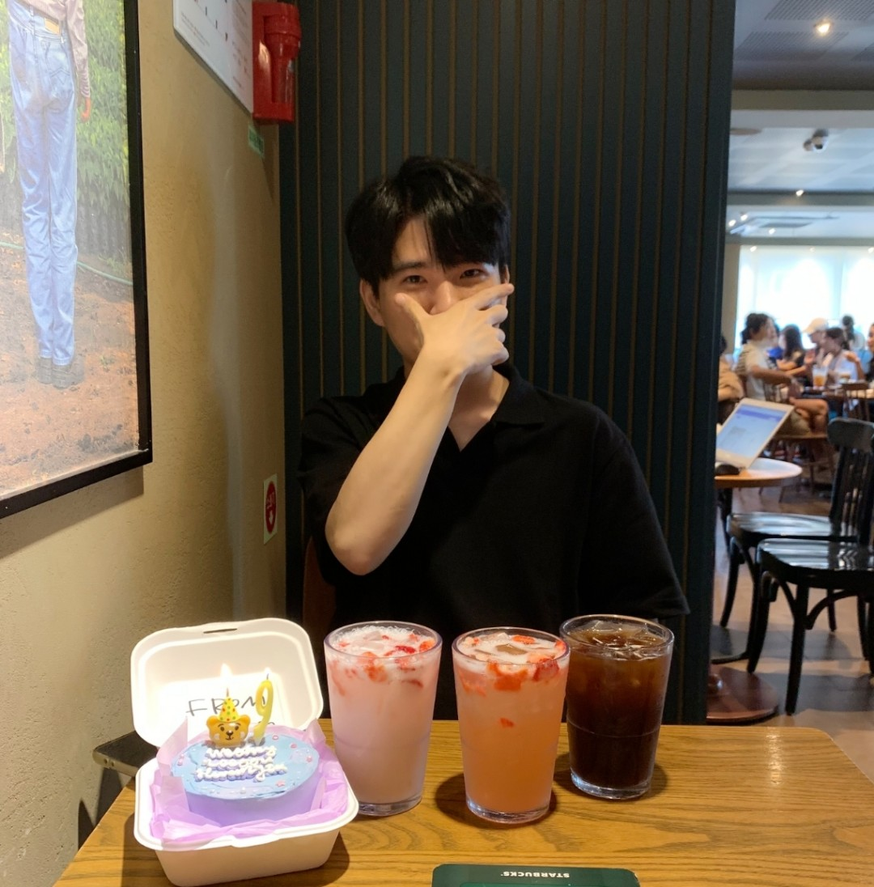

# yemint 위키 가오픈

||</img>|
|:--------:|:--------|
| **이름** | 황예찬 |
| **출생** | 1998년 9월 11일   경상북도 울진군|
| **국적** | 대한민국 |
| **혈액형** | B형 |
| **가족** | 부모님, 누나1996년생 |
| **취미** | 수학문제풀이, 큐브퍼즐 |
| **특기** | 아이돌 이름 맞히기 |
| **학력** | 죽변초등학교(졸업) 울진중학교(졸업) 울진고등학교(졸업) 한양대학교 ERICA 학사[[1]](#footnote1)[[2]](#footnote2) 카이스트 전산학부 석박통합과정  |
| **좌우명** | 내 맘대로 살거야 말리지 마 |
| **종교** | 기독교 |
| **MBTI** | INTP |
| **SNS** | [인스타그램](https://www.instagram.com/yemintmint/), [페이스북](https://www.facebook.com/profile.php?id=100005003012509) |

 

|목차|
|:--------|
|<b id="h1">[1](#headnote1)</b>. 소개 <b id="h2">[2](#headnote2)</b>. 학업 <b id="h3">&nbsp;&nbsp;&nbsp;&nbsp;[2. 1](#headnote3)</b>. 고등학교 입학 이전 <b id="h4">&nbsp;&nbsp;&nbsp;&nbsp;[2. 2](#headnote4)</b>. 고등학교 시절|

# <b id="headnote1">[1](#h1)</b>. 소개
H엔터테인먼트 소속 연예인으로 유튜브, 프로그래밍, 수학 등 여러 분야에서 활동하는 방송인이다.

# <b id="headnote2">[2](#h2)</b>. 학업

</img>
자세한 내용은 [황예찬/학업](https://github.com/yyxymint/yemintWiki_temp/blob/main/%ED%99%A9%EC%98%88%EC%B0%AC-%ED%95%99%EC%97%85.md) 문서를 참고하십시오.

# 3. 연예 활동

</img>
자세한 내용은 [황예찬/연예 활동](https://github.com/yyxymint/yemintWiki_temp/blob/main/%ED%99%A9%EC%98%88%EC%B0%AC-%EC%97%B0%EC%98%88%20%ED%99%9C%EB%8F%99.md) 문서를 참고하십시오.

# 4. 영상 활동
2011부터 2016년까지 울진중~울진고 시절 동안 독학한 영상편집 기술로 독보적인 영상작가 이미지를 구축하였고 당시 울진 학생들 내에서 상당한 유명세를 타게되었다. 영상들이 여전히 페이스북에 남아있기 때문에 시간이 많이 지난 지금도 '오랜만에 영상보고 그때 생각났다'는 등의 친구들의 메시지가 종종 온다고. 
현재 운영중인 유튜브 채널을 제외하고 황예찬이 참여한 영상 활동에 대해 정리한 필모그래피는 아래와 같다.
## 4. 1. 제작
아래 나열된 모든 작품에서 감독과 편집을 맡았다.
|연도|제목|출연|수상|
|:--:|:--:|:--:|:--:|
|2011|원정무 스페셜|골키퍼 및 수피수|교내 UCC 공모전 우수상 2011 솔향제 상영|
|2013|Dark Inception 예고편|조커|중3 영어 UCC 최우수작 첫 페이스북 좋아요 100개 돌파|
|2014|Don't do the drugs|피해자2|고1 사회 UCC 우수작 선정|
|2015|더 지니어스 라이징썬 예고편|수학강사||
|2015|교내 금연동영상 UCC|미출연||
|2015|고2 UFC 풋살대회 오프닝|캐스터||
|2015|수능대박기원축제 행사 VCR|미출연||
|2016|고3 EFC 탐구풋살대항전 오프닝|화학반 선수||
|2016|제 64회 울진고 졸업영상|암담한 학생|첫 페이스북 좋아요 200개 돌파|
|2016|~~2016 체육대회 오프닝~~ (미개봉)|미출연||
|2016|미래에서 돌아온 소년|몰려든 학생3|학교폭력 제로 및 언어문화 개선 UCC 대상|
|2017|졸업영상 Carry on|암담한 학생, 댄서||
|2017|오픈소스 65뉴스 홍보영상|어플 이용자||
|2017|참평안교회 성탄기념 트로피카나|토토로잠옷||
|2018|0&1 공식 프로모션 영상|본인||
|2019|CReAL 어플 홍보영상|고민남||
|2020|CReAL 어플 프로모션 영상|황어플||

## 4. 2. 단역출연
|연도|제목|출연|
|:--:|:--:|:--:|
|2015|울진고 홍보영상 립덥|로브레이커|
|2016|수학교육과 황예찬 교수를 찾아서|황교수||
|2017|제 65회 울진고 졸업영상|윤상호 선생님 성대모사|

# 5. 황예찬/여담
|생활 관련|
|:--------|
* 온라인상에서 'ㅋ' 사용을 극도로 자제한다. 고등학생 시절에 쓸데없이 ㅋ을 과도하게 사용하는 모 친구를 보고 ㅋ에 환멸이 났다고.
* 식사를 하는 기준은 시간이 아니라 배고픔의 정도라고 한다. 즉, 오후 12시라도 배가 안고프면 점심을 안먹는다. 대신에 배고파 쓰러지기 직전에 식사를 시작해 배가 터질때까지 식사를 하는게 본인의 식사 원칙이라고. 이런 식습관 탓에 식사 사이에 간식을 거의 먹지 않는다.
* 커피는 졸릴 때 잠을 참는 용도로만 먹는다고 한다. 그런 이유에서인지 식사 후 카페에 가면 대부분 커피 대신 과일음료를 주문하는 모습을 보인다.[[8]](#footnote8)
* 노래방 창법이 굉장히 독특한데, 모든 노래를 기본 여자키로 맞춘 뒤 거기에서 더 올려 가성으로 노래를 부른다. 코인노래방 가는 것을 좋아하니, 창법이 궁금하다면 같이 가보도록 하자.
* 개인 휴대전화로 갤럭시 S <b>3의 배수</b>만 사용한다. 2022년 기준 사용중인 기기는 S 21.
* 음식, 풍경사진은 절대로 찍지도 않고 SNS에 업로드하지도 않는다.
* 자신은 인터넷 망령이라 SNS에 돌아다니는 유머짤들의 99%는 이미 한참 전에 본 것이라고 한다.
* 2023년 1월, 개인 유튜브 구독자가 드디어 1,000명을 돌파했다.
* 고3 당시 울진고에 도전 골든벨이 방문했을 때, 최후의 1인이 되지 못했던 것이 무척 아쉽다고 한다. 당시 최종 5인에서 떨어졌는데, 그 당시 본인이 최후의 1인이 되었다면 아이오아이에게 직접 픽미를 보여줄 수 있었을것이라고 아쉬워했다.
* 2019년 12월에 멘사 정회원자격을 취득했다.
* 얼굴에 비해 팔다리가 굉장히 하얗다. 팔이야 가끔 반팔을 입어서 탈 기회가 있었지만 다리의 경우는 반바지를 거의 입지 않아 말그대로 백옥같다. 
* 중학교 시절 선도부를 했는데, 복장 불량 학생을 멈춰세울 용기가 없어서 자수하는 학생만 잡고 나머지는 그냥 들여보냈다고(..) 한다.
* 혼밥 레벨이 굉장히 높다. 대학생 시절 주 2회는 쿠우쿠우에 가서 식사시간 두 시간을 채웠고 지금도 뷔페에서 몇명이서 왔냐고 물으면 당당하게 '한명이요!'를 외친다고. ((알바생은 '얘 뭐지..?' 하는 표정을 짓는다고.))
* 학창시절 내내 꿈이 수학교사였을 만큼 수학과목을 상당히 좋아한다. 요즘도 졸릴때면 핸드폰에 저장해둔 수학문제를 풀고 모의고사 날이면 수학과목은 대부분 풀어본다고. 수학에 관해 더 자세한 내용은 황예찬/학업 문서를 참고하자.
* 식사 메뉴를 고르는 것과 밥을 먹는게 너무 귀찮다고 한다. 건강에 문제 없이 밥을 안먹어도 되는 수술이 생기면 무조건 할 것이라고.
* 고등학생때 까지는 본인의 성격이 모르는 사람에게 먼저 말도 잘 걸고 활발한 성격이었지만 수능 이후 자존감이 바닥을 쳐 성격이 많이 바뀌었다고 한다. 지금은 모르는 사람들 앞에서 말을 하는걸 상당히 어려워하고 이때문에 먼저 말을 걸어주는 사람들이 굉장히 고맙다고 한다.
* 2022년 8월 기준, 여전히 코로나에 걸린 적이 없다. 
* 학창시절 체육과목에서 시험은 100점맞고 수행평가 성적이 안좋아서 대부분 학생이 받는 '우수' 대신 '보통'을 받는일이 다반사였다고. 그나마 자신있는 운동으로 달리기와 턱걸이를 뽑았다.
* 시간을 철저히 지키는 것으로 유명하다. 이와 관련해서 본인은 <b>'내가 약속시간에 늦는 것은 일부러 늦는 것 외에는 없다'</b>라고 언급하였다.

|연예인 관련|
|:--------|
* 걸그룹 덕질을 매우 하드하게 한다. 아육대부터 음악방송 공방, 공항스케줄, 출근길, 팬싸인회, 영통팬싸 등 안겪어본 오프 행사가 없으며 프로듀스48 방영 시기에는 무려 세 번이나 방송에 등장하기도 하였다. 단, 콘서트는 별로 좋아하지 않는다고 한다. 본인 말로는 아티스트와 사람대 사람으로 만날 수 있는 팬싸인회를 더 선호한다고. 최애그룹은 프로미스나인이며 직접 팬싸인회에서 만나본 걸그룹들은 프로미스나인, 이달의소녀, 버스터즈, 에이프릴, 있지, 오마이걸, 에버글로우, 다이아, 모모랜드, 파나틱스. 유일하게 시도했다가 끝내 만나지 못한 그룹은 아이즈원. ((당시는 용돈으로는 도저히 컷을 넘길 가능성이 없었다고 한다.))
* 처음으로 좋아한 그룹은 2015년 Dumb Dumb 활동 당시 레드벨벳으로 안경쓴 아이린을 보고 반했다고 한다. 이후 2016년엔 아이오아이를 좋아했으며 4일만에 프로듀스101을 정주행했다고. 당시 최애 멤버는 김소혜.
* 덕질을 본격적으로 시작한 2018년 1월((프로미스나인의 데뷔))부터 단 하루도 스밍을 쉰 적이 없다고 한다. 한때는 자꾸 스밍이 멈추는게 짜증이나서 스밍 끊김 방지 매크로 어플을 만들었고 덕분에 현재는 끊김 없이 무호흡 스밍을 한다고.
* 2020년 개인 컨텐츠에서 본인 선정 걸그룹 미모 5대장으로 (전)에이프릴 이나은, ITZY의 신유나, (여자)아이들 미연, 오마이걸 비니, 아이즈원 김민주를 뽑았다.
* 워낙 걸그룹 돌판에 오래 있었다보니 보이그룹에 대한 지식도 나름 해박하다. 보이그룹중 관심있는 그룹은 크래비티, DAY6, 엑소. 좋아하는 얼굴을 가진 멤버로는 엔하이픈 성훈, 뉴이스트 황민현, 골든차일드 보민, 엑소 세훈, (전)워너원 옹성우.
* 오디션/서바이벌 프로그램 마니아다. 프듀 시리즈는 남자 시즌까지 챙겨보았고 아이돌학교, 퀸덤, 걸스플래닛999, 방과후 설렘 등 대부분의 오디션 프로그램에 직접 투표하며 과몰입했다. 단 본인 최애 픽은 대부분 탈락했다고.

<b id="footnote1">[[1]](#a1)</b> 7학기 조기졸업으로 소프트웨어학부(前 컴퓨터공학과) 전공, 세부전공은 컴퓨터전공 
<b id="footnote2">[[2]](#a2)</b> 응용수학과 부전공 
<b id="footnote8">[[8]](#a8)</b> 사실 밥먹고 카페 가는 것 자체를 별로 안좋아한다. 
